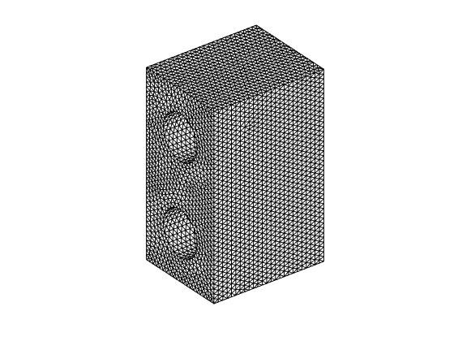
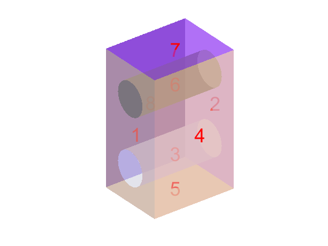

# Skin Model Shape Generation Process

## Acknowledgement
This work was conducted at Institut de Mécanique et d'Ingénierie (I2M), Université de Bordeaux. 
> Xingyu Yan, Alex Ballu. Generation of consistent skin model shape based on FEA method. Int J Adv Manuf Technol 2017. doi:10.1007/s00170-017-0177-5. <http://link.springer.com/10.1007/s00170-017-0177-5>

## 1 Creat Instance
To creat the instance of skin model, using method as below.
The instance "M" contains no data initially.

`M=SkinModel;`

## 2 Read STL Model
The STL file should be puted in current work folder, or sub-folders.
The name is a string ending with ".stl".
The format should be binary.
Using "Read" method to read the STL file, and put data into "M".

`M.Read('Test_Nominal_Model.stl');`

There are two properties inside the instance "M":

1. "V": n*3 vertices matrix. "n" is the number of vertices, 3 column corresponding to x, y, z coordinates.
2. "T": m*3 triangle matrix. "m" is the number of triangles, 3 column corresponding to the row number of 3 vertices in "V" matrix.

Using "ShowOrg" to plot the original model, which is usually considered as nominal model.

`M.ShowOrg;`

## 3 Segment Model into "K" Surfaces
The segmentation uses spectral based method:

1. At first, a matrix contains topological and geometrical information was constructed.
2. Then the eigenvectors correspond to the the first "N" largest "N" eigenvalues are calculated. The value of "N" is the first input of method "Seg".
3. Using "K-means" clastering algorithm and the "N" eigenvectors, the entrances in the eigenvectors are clastered. This corresponds to the segmentation of the model surfaces. "K" is the number of surfaces, which is the second input of method "Seg".

In simple application, we can assume the number of eigenvectors "N" is the same as the number of surfaces "K".
For test model, we set both value as "8"

`M.Seg(8,8);`

After segmentation, "K" surface properties are added.
For "SF(i)", it is a struct data. It contains several fields:

1. "F": the index of trangles inside this surface.
2. "T": n*4 matrix, the trangles of this surface. The first 3 column is the  vertices index, the 4-th column is the triangle index in matrix before segmentation.
3. "V": m*4 matrix, the vertices in this surface. The first 3 column is its coordinates, the 4-th column is its index in matrix before segmentation.
4. "N": normal vector of triangles.
5. "VN": normal vector of vertices. Estimated based on "N".
6. "D": deviation vector. Save the deviation value of vertex along normal direction.

After segmentation, we can plot the segmentation result using "ShowSeg" method.

`M.ShowSeg;`

Additionally, we can plot the numbering of each surface.

`M.ShowSegNum;`

If the segmentation result is not acceptable, we may have two choices:

1. Clean the skin model instance "M", change parameter "N" and "K", do the segmentation again. This is for the segmentation result is too far from expectation.
2. Using methods like "Reseg" and "Union" to modify the segmentation result. This is used when little modification could achive better result.

Once the segmentation of the nominal model is done, the user is suggested to save the current instance variable "M" into hard disc, Such as:

`save M_after_seg M`

In next time, user can load the model after segmentation directly:

`load M_after_seg`

This is to avoid conduct segmentation process each time.
Meanwhile,because the segmentation result is saved, users can define deviation simulation parameters for each surface, and simulate a batch of skin model shapes.

## 4 Simulate Manufacturing Deviations for Each Surface
To simulate manufacturing deviations, two types of process can be applied:

1. Using methods to assign deviation type and value for single feature directly.
2. Using deviation parameter table to simulat defects for all surfaces.

### "TR", "RO" & "MD"

In the first approach, methods such as "TR", "RO" and "MD" can be used.

Method "TR" indicates "Translation". The first input "id" indicates which surface will be translated. The second input "value" is a vector, which defines the translation value along "x", "y" and "z" axis.

`M.TR(id,value);`

Method "RO" indicates "Rotation". The first input is the surface "id". The second input the the degree of rotation along "x", "y" and "z" axis. Notice it is in degree, not in radian.

`M.RO(id,value);`

Method "MD" indicates "Modes". The first input is the surface "id", the second input "id_mode" is the numbering of mode (eigenvector). Because the eigenvector is normalized, the third input "scale" is used to control the maximum deviation value.

`M.MD(id_surf, id_mode, scale);`

### "DivTable"

In the second approach, we can define a table, which contains deviation information(which is the inputs in the first approach). Then using the "DivSim" method, form defects are simulated according to the table we have defined. The "DivSim" method actually calls methods "TR", "RO" and "MD".
To use the "DivTable", we first initialise it by "GetDivTable" method.

`M.GetDivTable;`

Then we can find "DivTable" property in the skin model instance "M". It is a table containing surface information and deviation information.

1. The first row of the table is deviation type (Translation, Rotation, and Modal).
2. The first colunm of the table is the numbering of surfaces.
3. By editing corresponding parameters, we can define different type of deviations for different surfaces.

For different types of deviations:

1. Translation: [x,y,z,mean,dev]. The first 3 variable is the translation direction vector. The magnitude of translation is generated by random parameter following Normal distribution. The "mean" and "dev" are mean value and standard deviation value for this distribution.
2. Rotation: [x,y,z,mean,dev]. The first 3 variable is the rotation axis vector. The magnitude of rotation is generated by random parameter following Normal distribution. The "mean" and "dev" are mean value and standard deviation value for this distribution.
3. Modal: [m1,m2,m3,......,mean,dev]. The first several variables indicates the modes used for simulation. The scales(coefficients) of the modes are generated following the Normal distribution. "mean" and "dev" are parameters for the Normal distribution (The number of modes are not limited, but if used, at least one).

For each type of defect, if we left the entrance in the table empty, corresponding defects will not be simulated.
To edit the table, we can edit it in the workspace, or load a pre-defined table. Here we load and use the "Table" defined before.

`load Table
M.DivTable=Table;`

Method "DivSim" will simulate the deviation according to the table.

`M.DivSim;`

## 5 Solving the Combination by FEA
The combination of the deviation value and nominal model are based on FEA. More details can be found in:

> Xingyu Yan, Alex Ballu. Generation of consistent skin model shape based on FEA method. Int J Adv Manuf Technol 2017. doi:10.1007/s00170-017-0177-5.  
<http://link.springer.com/10.1007/s00170-017-0177-5>

The input "1" is a scale value, which could be used to amplify the defects. In default, we set it "1".

`M.Comb(1);`

Properties for FEA, and the generated skin model shape, are hiden properties, which does not need to be modified.

After combination, the skin model shape could be shown by method "ShowSM".

`M.ShowSM;`

The user is suggested to save the instance once they have conducted the first time of combination(using "Comb").
This is because some data for conduct FEA will be saved. Reloading of these data will avoid unnecessary calculation.

`save M_after_comb M  
load M_after_comb`

## 6 Use of 'ResetD'
In some cases, we may not generate the desired form defects directly, and we may want to conduct the simulation again. Using "ResetD" method, we can erase the defects we have simulated, and conduct the simulation again from section **4 Simulate Manufacturing Deviations for Each Surface**. This avoided the clear and reload of the model.

`M.ResetD;`

## 7 Export Skin Model Shape in STL File
The generated skin model shape could be expoeted as STL file. Input is the file name ending with ".stl".

`M.ExportSTL('Test_Skin_Model_Shape.stl')`
